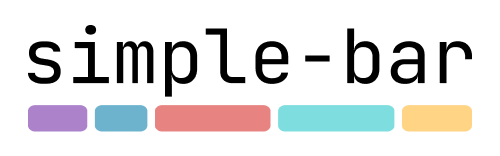
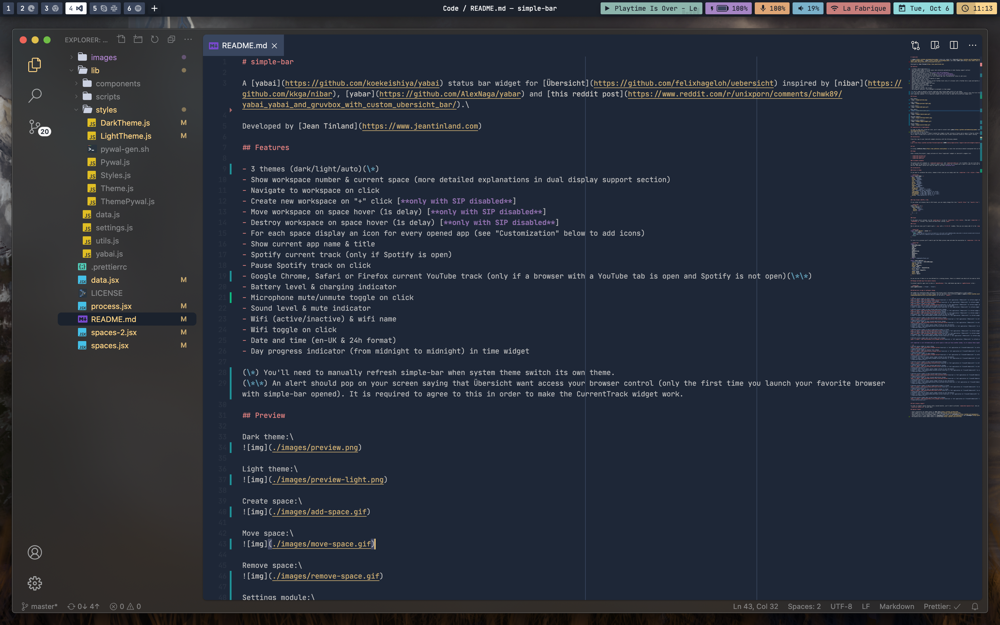

# 

A [yabai](https://github.com/koekeishiya/yabai), [AeroSpace](https://github.com/nikitabobko/AeroSpace) or [FlashSpace](https://github.com/wojciech-kulik/FlashSpace) status bar widget for [Übersicht](https://github.com/felixhageloh/uebersicht) inspired by [nibar](https://github.com/kkga/nibar), [yabar](https://github.com/AlexNaga/yabar) and [this reddit post](https://www.reddit.com/r/unixporn/comments/chwk89/yabai_yabai_and_gruvbox_with_custom_ubersicht_bar/).

[Website](https://www.jeantinland.com/toolbox/simple-bar) • [Documentation](https://www.jeantinland.com/toolbox/simple-bar/documentation)

[`simple-bar-server`](https://github.com/Jean-Tinland/simple-bar-server) is available to trigger refresh and toggle widgets more efficiently with `curl` commands.

A more "lite" & basic version is available [here](https://github.com/Jean-Tinland/simple-bar-lite).

## Features

Among the principal features of `simple-bar`, you'll find:

- **Show all opened apps** in every space
- **Show all opened windows** on the current space and its current layout mode (bsp, stack, float)
- Interactions: **focus window** on click, launch scripts, toggle states
- **Multi-monitor support**: enable individual widget on specific displays
- Add your own custom widgets in settings (it displays scripts outputs)
- **Refresh and toggle parts of simple-bar on the fly** with `curl` commands by installing [simple-bar-server](https://www.jeantinland.com/toolbox/simple-bar-server/documentation/introduction/) and enabling the server in settings. See [widgets](https://www.jeantinland.com/toolbox/simple-bar-server/documentation/widgets/), [yabai](https://www.jeantinland.com/toolbox/simple-bar-server/documentation/yabai/) or [AeroSpace](https://www.jeantinland.com/toolbox/simple-bar-server/documentation/aerospace/) options in its documentation
- **Extensible** themes system with 3 theme behaviors: **dark**, **light**, or **system**
- Numerous customization options, try them out in settings!
- A handfull selection of widgets
- Other features available only with SIP disabled and yabai scripting addition installed (**navigate to workspace**, **create new workspace on "+" click**, **move or destroy workspace on space hover**)

[See all features in documentation](https://www.jeantinland.com/toolbox/simple-bar/documentation/features/).

## Preview



<video src="https://github.com/Jean-Tinland/simple-bar/assets/43068795/0f988d1b-e21b-4b82-a1dc-4a1c76f580f3" type="video/mp4" muted autoplay loop></video>

## Installation

Simply clone this repo in your Übersicht widgets directory with the following command.

```bash
git clone --depth 1 https://github.com/Jean-Tinland/simple-bar $HOME/Library/Application\ Support/Übersicht/widgets/simple-bar
```

You'll find the full installation guide in the [documentation](https://www.jeantinland.com/toolbox/simple-bar/documentation/installation/).

> [!WARNING]\
> If you encounter this error: "simple-bar-index.jsx: Something went wrong…", it may be simply due to the fact that the default value for yabai, AeroSpace or FlashSpace path is wrong in simple-bar. You can set this path in the settings module.\
> The default paths are `$(which yabai)`, `$(which aerospace)` and `$(which flashspace)`.

> [!NOTE]\
> `simple-bar` is trying to use yabai by default. If you want to switch to AeroSpace, you'll need to open the settings module (simply click on `simple-bar` then press `cmd` + `,`). Same if you are using FlashSpace. You'll find the window manager choice in the "Global" tab.

> [!TIP]\
> If you experience some freezing issues with Übersicht or if you simply want to improve `simple-bar` responsiveness & energy consumption, please try to switch to `simple-bar-server` in order to trigger refresh with `curl` commands. You'll find more information about it in the repo [here](https://github.com/Jean-Tinland/simple-bar-server).

## Roadmap

Here are the features I'm planning to add in the future:

- A timer widget ([#474](https://github.com/Jean-Tinland/simple-bar/issues/474))
- Bars configurator (spawn multiple bars, place widgets anywhere…) [#380](https://github.com/Jean-Tinland/simple-bar/issues/380)
- More accessibility settings like reading direction (LTR or RTL)
- More default themes

Feel free to open an issue if you have any feature request or if you want me to prioritize one of these features.

## Special thanks

I started this project with a simple idea and inspired by similar projects but over the year it has become a real community project. I want to thank everyone who contributed to this project, whether it's by opening issues, suggesting features, or even making pull requests. Furthermore, I also want to thank everyone who is using this project, I'm glad to see that it can be useful to others.

So thank you, [@Amar1729](https://github.com/Amar1729), [@yorhodes](https://github.com/yorhodes), [@ZhongXiLu](https://github.com/ZhongXiLu), [@jamieweavis](https://github.com/jamieweavis), [@kvndrsslr](https://github.com/kvndrsslr), [@rosenpin](https://github.com/rosenpin), [@MikoMagni](https://github.com/MikoMagni), [@anujc4](https://github.com/anujc4), [@SijanC147](https://github.com/SijanC147), [@donaldguy](https://github.com/donaldguy), [@d-miketa](https://github.com/d-miketa), [@izifortune](https://github.com/izifortune), [@theshortcut](https://github.com/theshortcut), [@jming422](https://github.com/jming422), [@s00500](https://github.com/s00500), [@spwx](https://github.com/spwx), [@basbebe](https://github.com/basbebe), [@is0n](https://github.com/is0n), [@Joroovb](https://github.com/Joroovb), [@Sylenss](https://github.com/Sylenss), [@mrzone64](https://github.com/mrzone64), [@devinbhatt](https://github.com/devinbhatt), [@mdwitr0](https://github.com/mdwitr0), [@wr1159](https://github.com/wr1159), [@ardnep](https://github.com/ardnep), [@kntng](https://github.com/kntng) and every other that are helping me improve this little project by adding icons, fixing what they can, and more…

I tried to keep track of everyone who contributed to this project in every page of the documentation. If you think I forgot you, please let me know. :)
