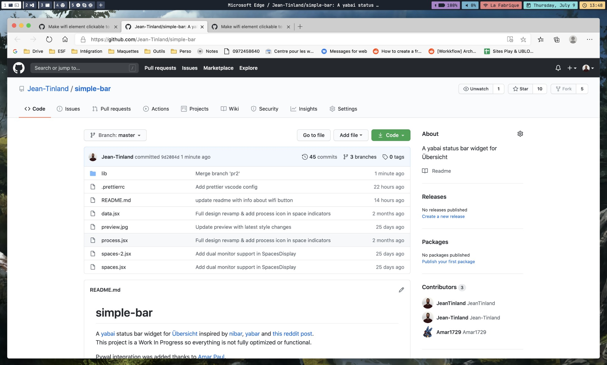

# simple-bar

A [yabai](https://github.com/koekeishiya/yabai) status bar widget for [Übersicht](https://github.com/felixhageloh/uebersicht) inspired by [nibar](https://github.com/kkga/nibar) and [yabar](https://github.com/AlexNaga/yabar).\
This project is a Work In Progress so everything is not fully optimized or functional.

## Features

- Show workspace number & current space (multiple displays is not tested yet)
- Show current app name & title
- Battery level & charging indicator
- Sound level & mute indicator
- Wifi (active/inactive) & wifi name
- Date and time (en-UK & 24h format)

## Screenshot



## Installation

Clone this repo to your Übersicht widgets directory with the following command.

```bash
$ git clone git@github.com:Jean-Tinland/simple-bar.git $HOME/Library/Application\ Support/Übersicht/widgets/simple-bar
```

## Usage

After cloning the project, simply activate all three "simple-bar" widgets in Übersicht's widgets list.

- `simple-bar-process-jsx`
- `simple-bar-spaces-jsx`
- `simple-bar-data-jsx`

## Customization

If you want to customize the colors used you can simply edit the `simple-bar > lib > styles > Theme.js` and put your colors in it.

```javascript
export const Theme = {
  main: '#1B222D',
  minor: '#39465E',
  accent: '#FFD484',
  red: '#E78482',
  font: 'Helvetica Neue, sans-serif',
  easing: 'cubic-bezier(0.4, 0, 0.2, 1)'
};
```

## Refresh bar on workspace change

The widget for displaying yabai workspaces and process aren't refreshing automatically or with a delay.\
To refresh them on space or display change, you can add these lines utilizing [yabai's signals](https://github.com/koekeishiya/yabai/wiki/Commands#automation-with-rules-and-signals) at the end of `.yabairc`:

```sh
yabai -m signal --add event=space_changed action="osascript -e 'tell application \"Übersicht\" to refresh widget id \"simple-bar-spaces-jsx\"'"
yabai -m signal --add event=display_changed action="osascript -e 'tell application \"Übersicht\" to refresh widget id \"simple-bar-spaces-jsx\"'"
yabai -m signal --add event=space_changed action="osascript -e 'tell application \"Übersicht\" to refresh widget id \"simple-bar-process-jsx\"'"
```
