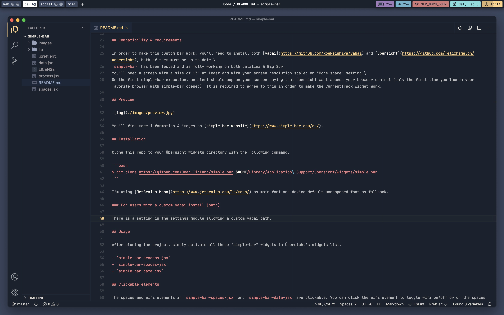

# simple-bar

A [yabai](https://github.com/koekeishiya/yabai) status bar widget for [Übersicht](https://github.com/felixhageloh/uebersicht) inspired by [nibar](https://github.com/kkga/nibar), [yabar](https://github.com/AlexNaga/yabar) and [this reddit post](https://www.reddit.com/r/unixporn/comments/chwk89/yabai_yabai_and_gruvbox_with_custom_ubersicht_bar/). Visit **simple-bar** website [here](https://www.simple-bar.com/en/).

Developed by [Jean Tinland](https://www.jeantinland.com).

## Features

- 3 themes behaviours: dark, light or automatic (synced with system)
- Extensible themes system
- Numerous customisation options (not sticky to top, no background, etc... Try it out in settings)(1)
- Toggle theme system wide(2)
- Display workspace number/label & current space
- Navigate to workspace on click
- For each space display an icon for every opened app (you can exclude specific apps/windows in settings based on process name or window title)
- Show all opened apps (and current) in current space or simply current app name & title
- Settings module (enable/disable each individual widget: see list below - switch dark/light theme)(1)
- Spotify, Music/iTunes, browser current track
- Battery, microphone, sound level, wifi, date, time widgets
- Weather & keyboard language input widgets (disabled by default)(3)
- You can add your own custom widgets in settings(1)
- **Only with SIP disabled**: create new workspace on "+" click, move or destroy workspace on space hover

(1) Settings can be opened by pressing `cmd + ,` after cliking on **simple-bar** widget. More details in [Settings](#settings) section.\
(2) Press `cmd + t` while focusing **simple-bar**.\
(3) You'll be prompted to let Übersicht use you geolocation.

## Compatibility & requirements

In order to make this custom bar work, you'll need to install both [yabai](https://github.com/koekeishiya/yabai) and [Übersicht](https://github.com/felixhageloh/uebersicht), both of them must be up to date.

Becareful, for Big Sur users, some actions must be taken in order to make yabai fully operational: [see here for more details](<https://github.com/koekeishiya/yabai/wiki/Installing-yabai-(latest-release)#macos-big-sur---automatically-load-scripting-addition-on-startup>).

`simple-bar` has been tested and is working on both Catalina & Big Sur.
You'll need a screen with a size of 13" at least and with your screen resolution scaled on "More space" setting.

**It is important to note that you'll need to use yabai in `bsp` or `stack` layout mode in order to prevent app windows to overlap simple-bar.**

On the first **simple-bar** execution, an alert should pop on your screen saying that Übersicht want access your browser control (only the first time you launch your favorite browser with **simple-bar** opened). It is required to agree to this in order to make the CurrentTrack widget work.

## Preview



You'll find more information & images on [simple-bar website](https://www.simple-bar.com/en/).

## Installation

Clone this repo to your Übersicht widgets directory with the following command.

```bash
$ git clone https://github.com/Jean-Tinland/simple-bar $HOME/Library/Application\ Support/Übersicht/widgets/simple-bar
```

**Becareful, the folder containing the widget must be name `simple-bar`, otherwise, simple-bar will never launch.**

[JetBrains Mono](https://www.jetbrains.com/lp/mono/) is used by default. You can set your own font in the "Global" settings tab.

### For users with a custom yabai install (path)

There is a setting in the settings module allowing a custom yabai path.

## Usage

After cloning the project, simply activate both **simple-bar** widgets in Übersicht's widgets list.

- `simple-bar-data-jsx`
- `simple-bar-spaces-jsx`

## Settings

As explained at the begining of this README file, Settings can be opened by pressing `cmd + ,` after cliking on **simple-bar** widget. You may want to click at the top center of the screen, where the process name of the current app is displayed in order to easily get focus on **simple-bar** before pressing `cmd + ,`.

In this settings module you'll find all the customization options available from layout to specific widgets show/hide toggle.

## Clickable elements

Some elements of **simple-bar** are interactives. For example :

- Toggle caffeinate mode on battery widget click (prevent your mac to sleep while activate)
- Toggle wifi on/off on wifi widget click
- Toggle microphone on microphone widget click
- Play/pause Spotify or Music-iTunes current song on Spotify/Music-iTunes widget click
- Open Calendar app on date widget click
- Open weather previsions in browser on weather widget click
- Remove, move spaces on space hover (1s delay / instant while `cmd` key is pressed) (**Only with SIP disabled**)
- Add space on "plus" button click (**Only with SIP disabled**)

Clickable elements have an outline showing up on hover in order to easily identify them.

## Customization

### Colors & theme

If you want to customize the colors, shadows, fonts, etc... you can simply tweak and existing theme or create your own in `simple-bar > lib > styles > themes`.

You can duplicate an existing theme and change the exported function name, the "name" and the "kind" (light or dark) properties.

Once you created your theme, you can import it in `simple-bar > lib > styles > themes > themes.js` and add it in the already exported themes. You theme should now appear in the "Themes" settings tab.

Feel free to open an issue if you want me to add a theme or if you created a theme and are willing to share it.

### Pywal

To use pywal colors instead, run the `pywal-gen.sh` script in `simple-bar > lib > styles > pywal`, then edit `simple-bar > lib > styles > theme.js` : `const WITH_PYWAL = false` must be set to "true".\
This should be done after running `pywal`.\
As I am not using this myself, I may have missed some problems, feel free to open an issue about it anytime.

### Icons

Now to add new icons you'll need to get a `.svg` with a `0 0 24 24` viewBox. Then you can simply add it to the `simple-bar > lib > components > Icons.jsx`:

```javascript
export const Caprine = (props) => (
  <Icon {...props}>
    <path d="M12 0C5.37 0 0 4.97 0 11.11c0 3.5 1.74 6.62 4.47 8.65V24l4.09-2.24c1.09.3 2.24.46 3.44.46 6.63 0 12-4.97 12-11.1C24 4.97 18.63 0 12 0zm1.2 14.96l-3.06-3.26-5.97 3.26L10.73 8l3.13 3.26L19.76 8l-6.57 6.96z" />
  </Icon>
)
```

To link it to a process you'll need to get the Yabai process name and make the association in `simple-bar > lib > app-icons.js` :

```javascript
import as * Icons from './components/Icons.jsx'

export const appIcons = {
  'Android Messages': Icons.AndroidMessages,
  Caprine: Icons.Caprine,
  Code: Icons.Code,
  Default: Icons.Default,
  Figma: Icons.Figma,
  'Google Chrome': Icons.GoogleChrome,
  Music: Icons.Music,
  'Sequel Pro': Icons.SequelPro,
  Skype: Icons.Skype,
  Slack: Icons.Slack,
  Zeplin: Icons.Zeplin
}
```

If there is no icon defined for a running process, there is a default one which will be used as fallback.

Same as for themes, feel free to open an issue if you have an icon request.

### Override default styles

As I tried to automate a lot of things, there may be some elements impossible to specificaly change by creating your own theme.

To remedy this problem, there is a tab in settings allowing you to override any **simple-bar** style you want.

You can simply add your styles here. As it is loaded after all the other styles this will naturally override the default styles.\
You can use the **Übersicht debug console** in order to inspect the widgets composing simple-bar and **get the class names you need to override**.

## Special thanks

- Pywal integration was added thanks to [@Amar Paul](https://github.com/Amar1729)
- Wifi toggle on click also added thanks to [@Amar Paul](https://github.com/Amar1729)
- Spotify current track & play/pause toggle on click and Dracula theme adaptation added thanks to [@jamieweavis](https://github.com/jamieweavis)
- Sticky windows workaround & several sticky windows options in settins added thanks to [@kvndrsslr](https://github.com/kvndrsslr)
- Right & middle click actions in Spotify, Wifi & all user widgets added thanks to [@rosenpin](https://github.com/rosenpin)
- Open space options on right click added thanks to [@rosenpin](https://github.com/rosenpin)
- Large selection of icons added thanks to [@jamieweavis](https://github.com/jamieweavis), [@MikoMagni](https://github.com/MikoMagni) and [@anujc4](https://github.com/anujc4)
- Microphone mute & unmute added thanks to [@izifortune](https://github.com/izifortune)
- A way better multiple display behaviour & handling added thanks to [@theshortcut](https://github.com/theshortcut)
- Gruvbox Dark theme adaptation added thanks to [@spwx](https://github.com/spwx)
- Gruvbox Light theme adaptation added thanks to [@basbebe](https://github.com/basbebe)
- Amarena Dark theme implementation thanks to [@MikoMagni](https://github.com/MikoMagni)
- Solarized Light & Dark themes implementation thanks to [@Joroovb](https://github.com/Joroovb)
- Everyone opening issues that are helping me improve this little project
