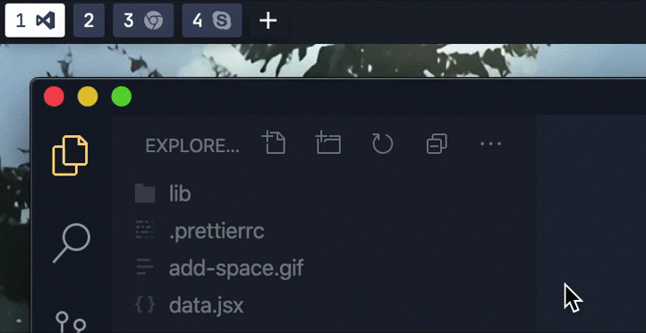
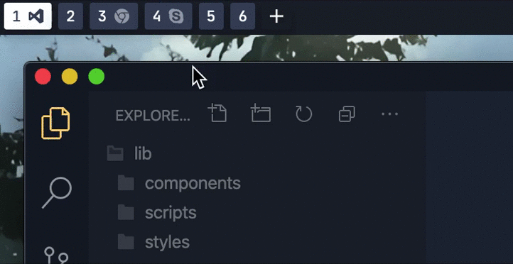

# simple-bar

A [yabai](https://github.com/koekeishiya/yabai) status bar widget for [Übersicht](https://github.com/felixhageloh/uebersicht) inspired by [nibar](https://github.com/kkga/nibar), [yabar](https://github.com/AlexNaga/yabar) and [this reddit post](https://www.reddit.com/r/unixporn/comments/chwk89/yabai_yabai_and_gruvbox_with_custom_ubersicht_bar/).\
This project is a Work In Progress so everything is not fully optimized or functional.

Pywal integration was added thanks to [Amar Paul](https://github.com/Amar1729).

Developed by [Jean Tinland](https://www.jeantinland.com)

## Features

- Synchronised with system theme
- Show workspace number & current space (more detailed explanations in dual display support section)
- Navigate to workspace on click
- Create new workspace on "+" click [**only with SIP disabled**]
- Move workspace on space hover (1s delay) [**only with SIP disabled**]
- Destroy workspace on space hover (1s delay) [**only with SIP disabled**]
- For each space display an icon for every opened app (see "Customization" below to add icons)
- Show current app name & title
- Battery level & charging indicator
- Sound level & mute indicator
- Wifi (active/inactive) & wifi name
- Wifi toggle on click (added thanks to [Amar Paul](https://github.com/Amar1729))
- Date and time (en-UK & 24h format)

## Preview

Dark theme:\


Light theme:\


Create space:\


Move space:\


Remove space:\


## Installation

Clone this repo to your Übersicht widgets directory with the following command.

```bash
$ git clone git@github.com:Jean-Tinland/simple-bar.git $HOME/Library/Application\ Support/Übersicht/widgets/simple-bar
```

## Font

I'm using [JetBrains Mono](https://www.jetbrains.com/lp/mono/) as main font and device default monospaced font as fallback.

## Usage

After cloning the project, simply activate all three "simple-bar" widgets in Übersicht's widgets list.

- `simple-bar-process-jsx`
- `simple-bar-spaces-jsx`
- `simple-bar-data-jsx`

### Clickable elements

The spaces and wifi elements in `simple-bar-spaces-jsx` and `simple-bar-data-jsx` are clickable. If you have an interaction shortcut enabled (`Übersicht > Preferences`), you can click the wifi element to toggle wifi on/off or on the spaces to go directly to a specific space. The "Add space" button will only be shown if you have **disabled SIP**

## Customization

If you want to customize the colors or fonts used you can simply edit the `simple-bar > lib > styles > Theme.js` and put your settings in it.

```javascript
export const Theme = {
  main: '#1B222D',
  minor: '#39465E',
  accent: '#FFD484',
  red: '#E78482',
  green: '#8FC8BB',
  yellow: '#FFD484',
  blue: '#6DB3CE',
  magenta: '#AD82CB',
  cyan: '#7EDDDE',
  font: 'JetBrains Mono, monospace',
  easing: 'cubic-bezier(0.4, 0, 0.2, 1)'
}
```

### Pywal

To use pywal colors instead, run the `pywal-gen.sh` script in `simple-bar > lib > styles`, then edit `simple-bar > lib > styles > Theme.js` to use `ThemePywal.js` instead. This should be done after running `pywal`.

### Icons

Now to add new icons you'll need to get a `.svg` with a `0 0 24 24` viewBox. Then you can simply add it to the `simple-bar > lib > components > Icons.jsx` :

```javascript
export const Caprine = (props) => (
  <Icon {...props}>
    <path d="M12 0C5.37 0 0 4.97 0 11.11c0 3.5 1.74 6.62 4.47 8.65V24l4.09-2.24c1.09.3 2.24.46 3.44.46 6.63 0 12-4.97 12-11.1C24 4.97 18.63 0 12 0zm1.2 14.96l-3.06-3.26-5.97 3.26L10.73 8l3.13 3.26L19.76 8l-6.57 6.96z" />
  </Icon>
)
```

To link it to a process you'll need to get the Yabai process name and make the association in `simple-bar > lib > data.js` :

```javascript
import {
  AndroidMessages,
  Caprine,
  Code,
  Default,
  Figma,
  GoogleChrome,
  Music,
  SequelPro,
  Skype,
  Slack,
  Zeplin
} from './components/Icons.jsx'

export const appIcons = {
  'Android Messages': AndroidMessages,
  Caprine: Caprine,
  Code: Code,
  Default: Default,
  Figma: Figma,
  'Google Chrome': GoogleChrome,
  Music: Music,
  'Sequel Pro': SequelPro,
  Skype: Skype,
  Slack: Slack,
  Zeplin: Zeplin
}
```

As you can see if there is no icon defined for a running process, there is a default one which will be used as fallback.

## Manage excluded app from spaces display

To prevent specific apps icon to show in `SpacesDisplay` file, add/remove app name in `appExclusions` array :

```javascript
const appExclusions = ['Finder', 'iTerm2']
```

## Refresh bar on app or workspace change

The widget for displaying yabai workspaces and process aren't refreshing automatically or with a delay.\
To refresh them on space or display change, you can add these lines utilizing [yabai's signals](https://github.com/koekeishiya/yabai/wiki/Commands#automation-with-rules-and-signals) at the end of `.yabairc`:

```sh
# Refresh spaces widget on space change
yabai -m signal --add event=space_changed action="osascript -e 'tell application \"Übersicht\" to refresh widget id \"simple-bar-spaces-jsx\"'"
# Refresh spaces widget on display focus change
yabai -m signal --add event=display_changed action="osascript -e 'tell application \"Übersicht\" to refresh widget id \"simple-bar-spaces-jsx\"'"
# Refresh process widget on space change
yabai -m signal --add event=space_changed action="osascript -e 'tell application \"Übersicht\" to refresh widget id \"simple-bar-process-jsx\"'"
# Uncomment next line to enable spaces widget refresh on your 2nd monitor
# yabai -m signal --add event=space_changed action="osascript -e 'tell application \"Übersicht\" to refresh widget id \"simple-bar-spaces-2-jsx\"'"

# Refresh process widget on when focused application changes
yabai -m signal --add event=application_front_switched action="osascript -e 'tell application \"Übersicht\" to refresh widget id \"simple-bar-process-jsx\"'"
# Refresh spaces widget on when focused application changes
yabai -m signal --add event=application_front_switched action="osascript -e 'tell application \"Übersicht\" to refresh widget id \"simple-bar-spaces-jsx\"'"

# Refresh process widget on when an application window is closed
yabai -m signal --add event=window_destroyed action="osascript -e 'tell application \"Übersicht\" to refresh widget id \"simple-bar-process-jsx\"'"
# Refresh spaces widget on when an application window is closed
yabai -m signal --add event=window_destroyed action="osascript -e 'tell application \"Übersicht\" to refresh widget id \"simple-bar-spaces-jsx\"'"

```

## Dual display support

In order to support spaces display with a second monitor, you'll need to activate `simple-bar-spaces-2-jsx` only on your secondary monitor and `simple-bar-spaces-jsx` on your main.
